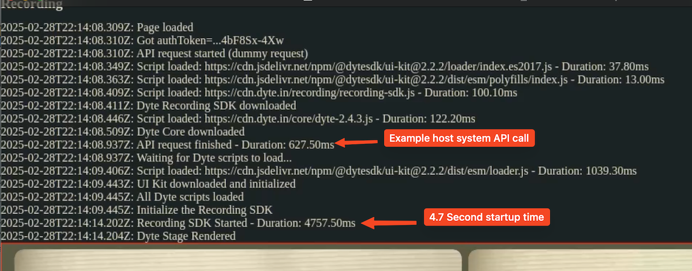

# Dyte Recording Stage

This is a bare minimum debugging page for Dyte recording stage to identify potential slowdowns in recording startup time. Note that the page makes an API request to a public endpoint just to simulate querying your own system for data. The timings of this API call are very similar to other "real" servers I've been using to send stage layout data to this page. The goal here is to find the longest blocking activity.



## To Setup

Follow the typical instructions on the getting started pages of Dyte: [Dyte Quickstart](https://docs.dyte.io/react-ui-kit/quickstart).

Modify the meeting initialization to use this url instead of the standard/default recording stage:

```
initMeeting({
  authToken: '<auth-token>',
  defaults: {
    audio: false,
    video: false,
    recording: {
      url: 'https://cjweed.com/dyte-recording-stage'
    } as never
  },
});
```

When you click the record button it'll request that url instead and hand it the proper Dyte auth url via search params.  Basically it "just works". Your recording should look similar to the image above.
